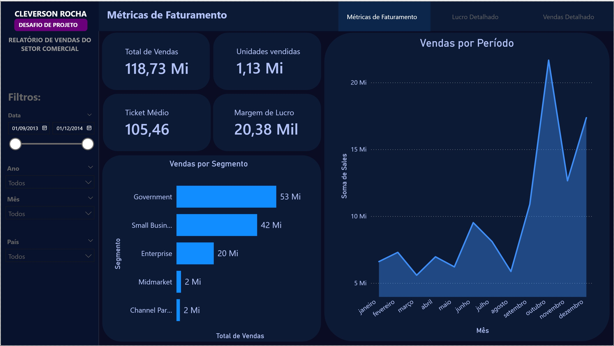
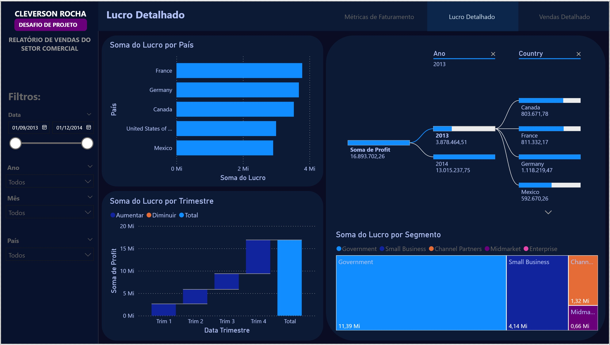
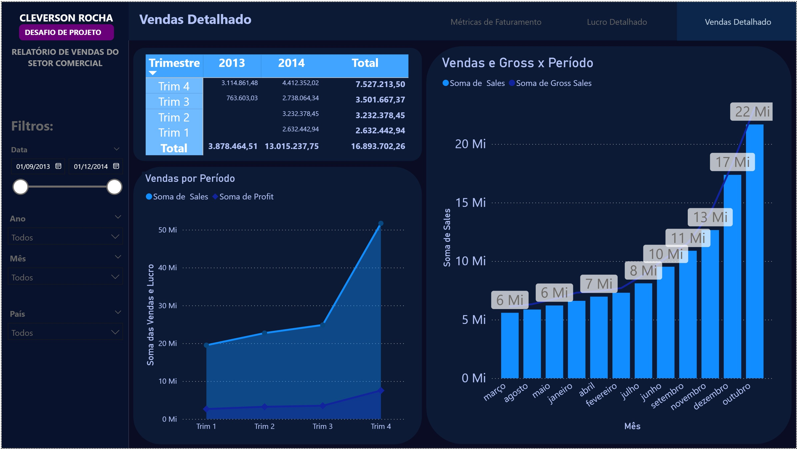

# Desafio de Projeto: Power BI com Foco em User Experience (UX)

Este repositório contém a resolução do desafio de projeto da DIO, onde o objetivo foi atualizar um relatório financeiro aplicando conceitos fundamentais de Design e Experiência do Usuário para tornar a leitura de dados mais fluida e intuitiva.

## 📊 O Projeto
O foco desta entrega foi transformar um relatório criativo em uma ferramenta funcional e esteticamente equilibrada, utilizando técnicas que guiam o olhar do usuário e facilitam a tomada de decisão.

### Principais Implementações de UX:
* **Posicionamento Estratégico:** Organização dos elementos seguindo o fluxo de leitura ocidental (da esquerda para a direita, de cima para baixo).
* **Contraste e Cores:** Utilização de cores para destacar KPIs importantes e garantir acessibilidade visual.
* **Proporção Áurea:** Aplicação de conceitos de proporção para equilibrar o tamanho dos visuais na tela.
* **Segmentação de Dados:** Filtros posicionados para permitir uma exploração dinâmica e rápida.

## 🛠️ Modificações Realizadas
Conforme as diretrizes do desafio, as seguintes etapas foram cumpridas:
1.  **Reestruturação do Visual de Área:** Melhoria na visualização de tendências temporais.
2.  **Matriz de Descrição de Vendas:** Criação de uma visão detalhada e hierárquica das transações.
3.  **Navegabilidade:**
    * Criação de menus de navegação em todas as páginas.
    * Configuração de botões com estados de "foco" e "seleção" para feedback visual ao usuário.
    * Padronização estética das 3 páginas do relatório.

## 🖼️ Visualização do Relatório

Aqui estão os prints das três páginas que compõem o relatório finalizado, demonstrando a aplicação dos conceitos de UX, navegação e estilização.

